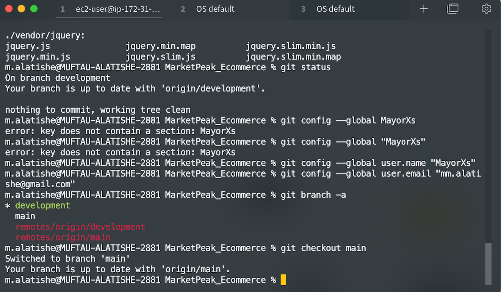

# MarketPeak E-Commerce Deployment

## Project Overview
MarketPeak is an e-commerce platform featuring product listings, a shopping cart, and user authentication.  
This project involves setting up version control with Git, developing in a Linux environment, and deploying on AWS EC2.  
The goal is to demonstrate a complete DevOps workflow from local development to cloud deployment.

---

## Project Evidence Screenshots
All project screenshots will be stored in the **/screenshots** folder in the root of this repository.  
Example Markdown for adding a screenshot in your README:
```markdown

```

---

## Phase 1 – Sync & Review (Completed ✅)
**Tasks Performed:**
- Cloned existing GitHub repository to local machine.
- Verified website template files exist (`index.html`, `about.html`, `contact.html`, product pages, CSS/JS assets).
- Confirmed repository was initialized with Git.
- Checked remote linking to GitHub (`origin`).
- No uncommitted changes at the start.

**Evidence:**
- 
- 
- 

---

## Phase 2 – Git Version Control Setup (Completed ✅)
**Tasks Performed:**
- Configured global Git username and email.
- Verified presence of `main` and `development` branches.
- Pushed both branches to GitHub to ensure remote synchronization.

**Evidence:**
- 
- 
- 

---

## Phase 3 – Linux Development Environment (Upcoming)
**Planned Tasks:**
- Switch to `development` branch for new updates.
- Implement additional features or content updates.
- Merge changes from `development` into `main`.

---

## Phase 4 – AWS Deployment (Upcoming)
**Planned Tasks:**
- Launch Amazon EC2 instance (Amazon Linux 2023 AMI).
- Transfer website files to EC2 instance via SCP/SFTP.
- Install Apache HTTP server (`httpd`).
- Configure server to serve website.
- Access site in browser via EC2 public IP.

---

## Phase 5 – CI/CD Workflow (Upcoming)
**Planned Tasks:**
- Use Git branching for updates.
- Push changes to GitHub and pull updates on EC2 server.
- Automate deployment steps where possible.

---

## Phase 6 – Documentation & Submission (Upcoming)
**Planned Tasks:**
- Complete README.md with final documentation, screenshots, and troubleshooting notes.
- Share GitHub repository link for project submission.
